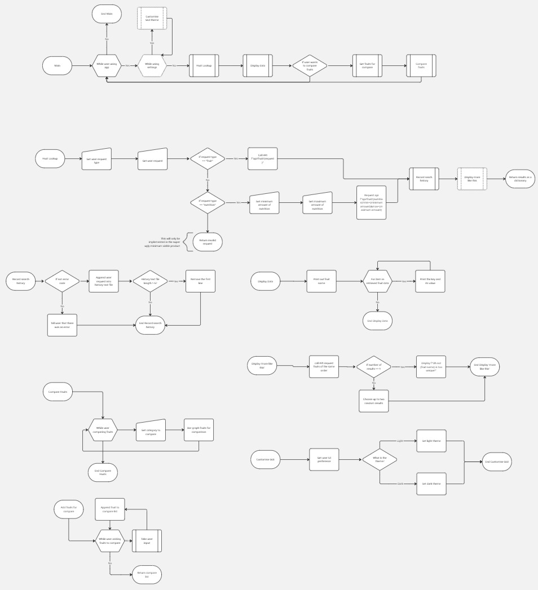

# Documentation
## Project requirements
### Functional
**Must haves:** 
> - User can get nutritional information on a particular fruit. 
> - User can get graphical comparison on fruits on a particular nutrition
> - User can look up fruits by filtering by nutrition
> - User can select and compare fruit by nutrition

**Should haves:**
- A search history
- Graphical user interface with checkboxes, sliders and textboxes

**Could haves:**
- Data cleaning module (Although the data seems quite clean already)
- Search Predictor
- "More like this" section 
- Theme customisation

**Won't haves:**
- Adding fruits, even though the API allows it

### Non-functional
**Musts:**
> - Elegant error handling; user should not see tracebacks
> - Run on minimal storage and computer power

**Shoulds**
- GUI should be intuitive; know how to use it upon seeing the front page
- Rounded corners GUI
- Data loads and is shown within the second plus request time

## Design
### Structure Chart

Structure chart

### Flowchart

[Flowchart link (recommended)](https://miro.com/app/board/uXjVG2q2jSU=/?share_link_id=23078941805)

Flowchart as an image

(Dotted borders indicate features that may or may not be included)

### Gantt Charts

Gantt chart

### Data Table

Data table

|Variable                |Type  |Size in Bytes| Description                      |Example	|
|------------------------|------|-------------|----------------------------------|----------|
|name                    |String|5 B          |Common name of the fruit          |"Apple"   |
|id                      |Number|2 B          |ID number of fruit in API         |6         |
|nutritions              |Dict  |40 B         |Nutritional information container |{...}     |
|nutritions.calories     |Number|8 B          |Energy content per 100g           |52        |
|nutritions.fat          |Number|8 B          |Fat content per 100g (g)          |0.4       |
|nutritions.sugar        |Number|8 B          |Sugar content per 100g (g)        |10.3      |
|nutritions.carbohydrates|Number|8 B          |Carbohydrates per 100g (g)        |11.4      |
|nutritions.protein      |Number|8 B          |Protein per 100g (g)              |0.3       |

### GUI designs (unimplemented for now)

GUI designs

Front page

After user has searched something up

Screen for comparison

## Integration

**Screenshots**

## Testing & Debugging
### Test of 15/3/2026
Bugs:
- When searching, if it does not return a value, it crashes at line 20
- Must add in a dedicated compare fruits selection
- Doesn't access compare fruits feature at all

## Maintainance
