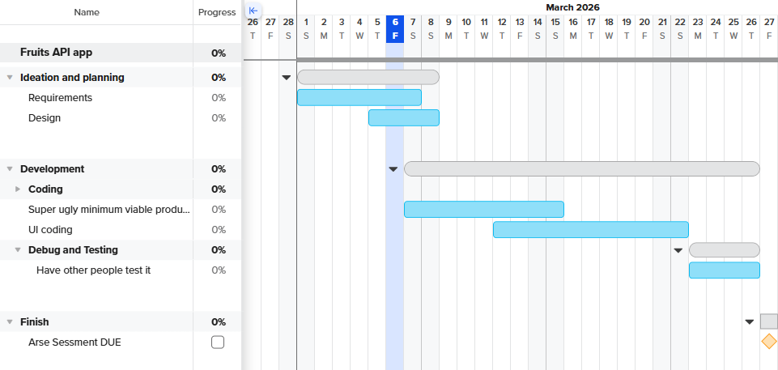

## 1. Functional Requirements 
(What the system should do)

Consider the following elements when developing your functional requirements:

Data Retrieval: What does the user need to be able to view in the system?

User Interface: What is required for the user to interact with the system?

Data Display: What information does the user need to obtain from the system?

## 2. Non-Functional Requirements 
(How the system should work)

Consider the following elements when developing your non-functional requirements:

Performance: How well does the system need to perform?

Reliability: How reliable does the system and data need to be?

Usability and Accessibility: How easy to navigate does the system need to be? What instructions will we need for users to access the system?

# Documentation
## Project requirements
### Functional
**Must haves:** 
> - User can get nutritional information on a particular fruit. 
> - User can get graphical comparison on fruits on a particular nutrition
> - User can look up fruits by filtering by nutritions
> - User can compare fruit nutritions

**Should haves:**
- A search history
- Graphical user interface with checkboxes, sliders and textboxes

**Could haves:**
- Data cleaning module (Although the data seems quite clean already)
- Search Predictor
- "More like this" section 
- Theme customisation

**Won't haves:**
- Adding fruits, even though the API allows it

### Non-functional
**Musts:**
> - User should not be able to see error codes and instead see text corresponding to the error code
> - Rounded corners GUI
> - Run on minimal storage and computer power

**Shoulds**
- GUI should be intuitive; know how to use it upon seeing the front page
- Data loads and is shown within the second

## Design
**Flowcharts**

[Flowchart link](https://miro.com/app/board/uXjVG2q2jSU=/?share_link_id=23078941805)
(Dotted borders indicate features that may or may not be included)

**Gantt Charts**

## Integration

**Screenshots**

## Testing & Debugging

## Maintainance
